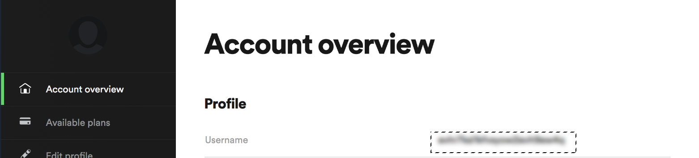

# AutomaçãoSpotify
Um script com a finalidade de gerar uma playlist no Spotify automaticamente com base nos vídeos que você gostou no Youtube.

## Conteúdo
* [Video](#Video)
* [Tecnologias utilizadas](#Tecnologias)
* [Configuração](#Configurações locais)
* [Solução de problemas](#Solução de problemas)

## Video
Vídeo demonstrando o funcionamento 
[Youtube Video]

## Tecnologias utilizadas
* [Youtube Data API v3]
* [Spotify Web API]
* [Requests Library v 2.22.0]
* [Youtube_dl v 2020.01.24]

## Configurações locais
1) Instale todas as dependências  
`pip3 install -r requirements.txt`

2) Obtenha seu Spotify User ID e Oauth Token e os adicione ao arquivo secrets.py.
    * Para obter seu User ID, logue no Spotify e vá aqui: [Account Overview] e esse será seu **Username**
    
    * Para obter o Oauth Token, visite este URL: [Get Oauth] e clique no botão **Get Token**
    

3) Habilite o Oauth para youtube e insira as informações no  client_secrets.json   
    * Esta parte pode ser um pouco complicada mas é só seguir esse tutorial [Set Up Youtube Oauth] ! 
    

4) Rode o arquivo!
`python3 create_playlist.py`   
    * Você verá a seguinte mensagem `Please visit this URL to authorize this application: <some long url>`
    * clique e logue em sua conta google para obter o  `código de autorização`

## Solução de problemas
* O token do Spotify expira muito rápido, se por acaso visualizar a mensagem  `KeyError` o motivo da mesma pode ser um token expirado. Volte ao passo 3 e gere um novo token!

   [Youtube Data API v3]: <https://developers.google.com/youtube/v3>
   [Spotify Web API]: <https://developer.spotify.com/documentation/web-api/>
   [Requests Library v 2.22.0]: <https://requests.readthedocs.io/en/master/>
   [Account Overview]: <https://www.spotify.com/us/account/overview/>
   [Get Oauth]: <https://developer.spotify.com/console/post-playlists/>
   [Set Up Youtube Oauth]: <https://developers.google.com/youtube/v3/getting-started/>
   [Youtube Video]:<https://youtu.be/yODcEoZ0DPY>
   [Youtube_dl v 2020.01.24]:<https://github.com/ytdl-org/youtube-dl/>
  